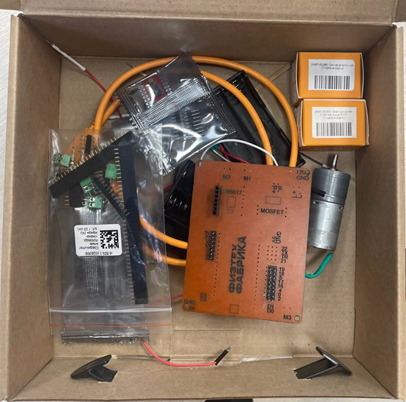
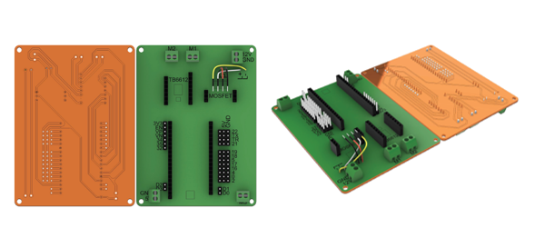
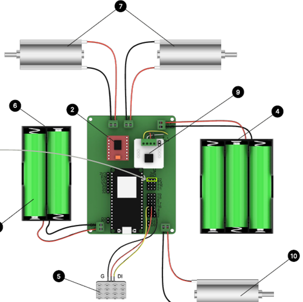
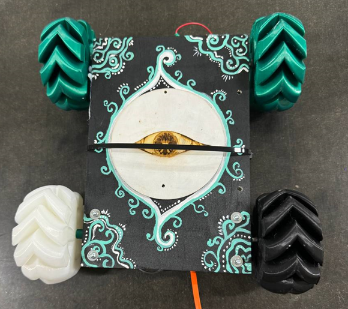
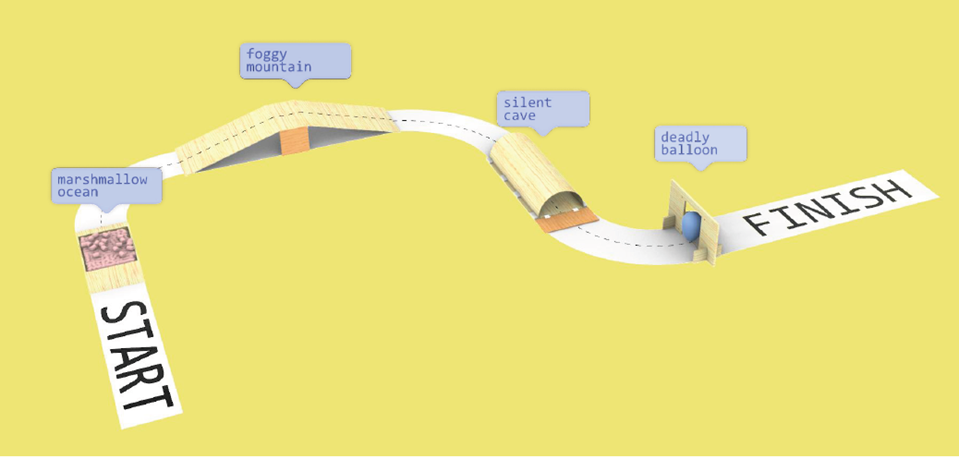
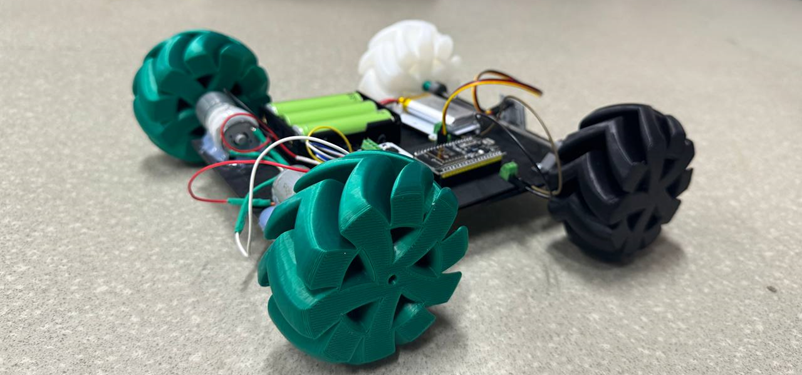
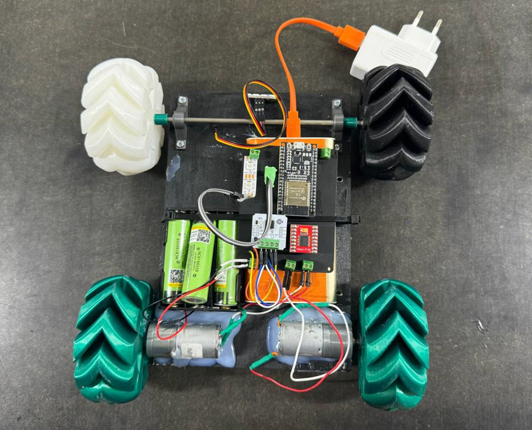
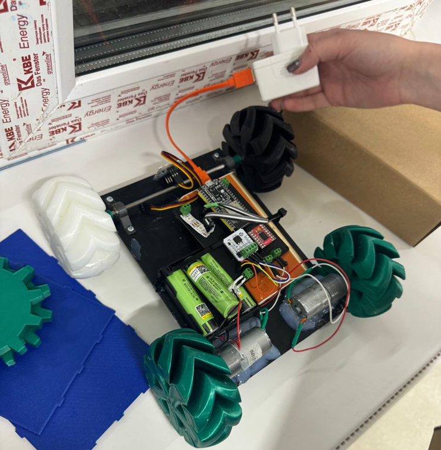

# Проект: Робот с дистанционным управлением для прохождения полосы препятствий

## Состав команды:
- Дымченко Светлана (Б04-305)
- Иванина Екатерина (Б04-305)
- Хисамова Амина (Б04-304)

## Компоненты робота:
- ESP32 Dev Module (+USB Micro)
- Драйвер для двух моторов TB6612
- x5 аккумулятор Li-ion 18650
- x1 держатель для 3 аккумуляторов
- x1 LED-матрица или лента
- х1 держатель для 2 аккумуляторов
- x2 DC-мотор 12В с редуктором
- РСВ-шилд
- Макетная плата
- Болты, гайки
- Клей, стяжки
- Провода
- Филаменты PLA

### Вот такой набор компонент у нас был сначала

## Используемые инструменты/машины:
- Паяльник
- Оловоотсос
- Компьютер для моделирования компонент в Solidworks и работы со слайсерами
- 3-D принтеры
- Машина для лазерной резки
- Клеевой пистолет
- Фен
- Отвертки
- Плоскогубцы
- Кусачки
- Пинцеты

## Сборка робота:

1. **Сборка РСВ-шилда**
    - Установили клеммники, штыревые гнезда «мама», штыревые вилки и припаяли их с обратной стороны.

2. **Подключение питания и моторов**
    - Подключены моторы на ходовую часть, как на рисунке.

3. **Механизмы и корпус робота**
    - Были спроектированы в Solidworks и распечатаны на 3-D принтерах колеса. Все компоненты закрепляются на доску, для дизайна которой использованы краски и лазерная гравировка.

## Программирование управляющей платы:
- Для программирования управляющей платы предварительно установлена среда Arduino Studio.
- Установлены библиотеки (TB6612, AsyncTCP-master, ESPAsyncWevServer-master, ESP32Servo, Adafruit_NeoPixel), плагины (esp32, Arduion_JSON, AnalogWrite), драйвер USB-UART CP210x_VCP_Windows.
- Управление роботом производится с телефона.

## Поставленная задача и некоторые сложности:
По задумке робот должен преодолеть следующую полосу препятствий:
- **marshmallow ocean** – бассейн с зефиром глубиной 50 мм
- **foggy mountain** – горка высотой 200 мм, шириной 320 мм и углом наклона ~16⁰
- **silent cave** – тоннель длиной 1300 мм и высотой 290 мм, ворота которого открываются при увеличении освещенности (срабатывает фоторезистор)
- **deadly balloon** – шарик, привязанный к арке, отделяющий робота от финиша

Прежде чем мы пришли к успешному прохождению всех препятствий, мы столкнулись со следующими сложностями:
- Было недостаточно прочно приклеено одно из задних колес, оно отлетело при первом тесте, мы растопили оставшийся клей феном и более прочно подклеили его заново.
- При том же тесте выяснилось, что полярность подключения моторов неверно соблюдена, мы поменяли местами соответствующие провода.
- При втором тесте одно из задних колес вращалось сильно медленнее другого. Изначально была мысль, что проблема в моторе, но проблема была в том, что колесо слетело с оси, мы более прочно подклеили его обратно.
- При третьем тесте робот не мог заехать на горку из-за недостаточного сцепления с поверхностью, мы добавили на колеса тонкий слой клея.
- Чтобы пробить шарик на финише, мы в результате решили использовать отвертку.
- Светодиоды изначально тратили слишком много тока, и робот переставал ехать, поэтому мы уменьшили их количество.

## Результат:

## Видео

